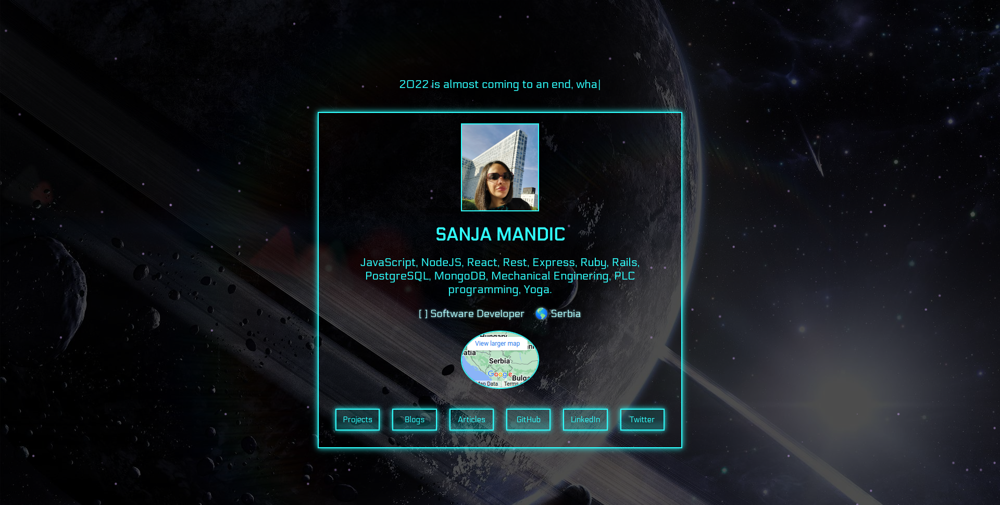

# Personal Portfolio

My personal portfolio where you can see four different pages and navigate to my other medias.
It is Driven by MongoDB, where are stored projects, blogs, articles and quotes that are appearing on home page.

## Technologies

- NodeJS, Express, Javascript, MangoDB, Mongoose, Docker, REST, React, Redux, Redux-Saga, Reselect, Styled-Components, AWS-EC2

## Created ES2 server on AWS. See live demo:

[AWS-EC2-Live](https://sanja-mandic.com/)

## Architecture Diagram

  <kbd>
    
  </kbd>

# Getting Started

To get a local copy up and running follow these simple example steps.

### Download it as a ZIP file
or

### Clone it in your local machine using GIT
to get a local copy , clone the repository using git clone
(git@github.com:Sanja969/Portfolio2.git)

After you clone it run  the following commands:

- npm install
- create MongoDB database in MongoDB Atlas and create your own dotenv mongo data for connecting to database
- npm run deploy
- npm run watch

## Authors

👤 **Sanja Mandic**

I am an aspiring web developer from Serbia.
- GitHub: [@sanjaGit](https://github.com/Sanja969)
- Twitter: [@sanjaTwit](https://twitter.com/SanjaMandic42)
- LinkedIn: [@sanjaIn](https://linkedin.com/in/sanja-mandic-823995a2/)

## 🤝 Contributing

Contributions, issues, and feature requests are welcome!

Feel free to check the [issues page](../../issues/).

## Show your support

Give a ⭐️ if you like this project!

## Acknowledgments

- Hat tip to anyone whose code was used
- Inspiration
- etc

